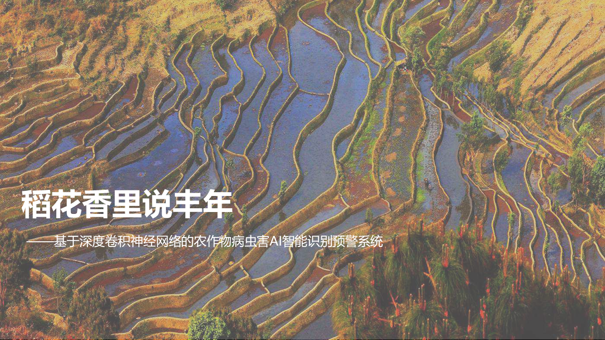

# 稻花香里说丰年—农作物病虫害AI智能识别预警系统“智农”

[TOC]

> 2019-12-09

# 一句话介绍“智农”：拍照识别病虫害

农民伯伯只需要给自己的庄稼叶子拍张照片，人工智能就能识别出农作物的病虫害种类，给出精准的防治建议，并构建大范围农作物病虫害数据采集与预防预警系统，精准预防治理农作物病虫害。

助力精准扶贫、乡村振兴、智慧农业的同济智慧：将论文写在祖国大地上，写入田间地头里。

# 如何使用“智农”：有网就能用

网页：只要有网就能用

微信小程序：只要有微信就能用

QQ小程序：只要有QQ就能用

支付宝小程序：只要有支付宝就能用

安卓APP、IOS端APP：只要有智能手机或平板就能用

Python小程序：提供开发者SDK与API接口

拍照、上传、一秒即可看到识别结果。

打开即用，用完即走，充分体现互联网产品轻量化、智能化、云计算的用户交互特点。

目前支持苹果、樱桃、玉米、葡萄、柑桔、桃、辣椒、马铃薯、草莓、番茄等常见病虫害识别。

完整病害列表见[60种农作物病虫害标签]( https://github.com/xungeer29/AI-Challenger-Plant-Disease-Recognition/blob/master/README.md )

# “智农”的应用场景：AI精准农业落地应用

拍照识别病虫害，作物病害早预警。

农药化肥精准投，无人机植保采集。

大范围病害感知，粮食安全宏观控。

论文写在黑土地，乡村振兴助扶贫。

# "智农"灵感：拍照识别植物和狗狗

这个项目的灵感来源于植物AI图像识别APP“形色”，和微软亚洲研究院开发的“识花君”APP，既然植物和花朵可以识别，那么农作物叶子反映的病虫害也可以识别。

# “智农”愿景：人工智能助力精准扶贫与乡村振兴

我国每年有1.2亿吨粮食因农作物病虫害减产，相当于三亿人的口粮。

以番茄为例，白粉病、疮痂病、早疫病、晚疫病、叶霉病、斑点病、斑枯病、红蜘蛛、黄化曲叶病毒病……困扰着千千万万果农的生计，影响着百姓的菜篮子，威胁着国家的粮食安全。

人工识别效率极低，需要专业的植保、农科专家才能准确分辨。在病害的萌芽早期容易漏检，错过最佳防治期。

对于农科院和植保机构，仍旧依靠实地采样与人工判断，缺乏定量化、细粒度、大规模、精准定制化的农作物病害数据采集、存储、识别、预警系统。

党的十九大报告提出：深化供给侧结构性改革，推动互联网、大数据、人工智能和实体经济深度融合，在多个领域培育新增长点，形成新动能 。实施乡村振兴战略。

“一叶落而知天下秋”，“智农”希望借助人工智能与先进的计算机视觉算法，助力乡村振兴和精准农业，保障国家粮食安全与消费者的食品安全。

# “智农”的黑科技：卷积神经网络与迁移学习

我们通过分析AI Challenge 2018农作物病虫害开源图像数据集，对常见的10种农作物，27种病虫害，5万张图像，构建深度卷积神经网络进行迁移学习，实现图像分类。

以卷积神经网络CNN为代表的图像分类算法近年来迅速发展，并超过人类水平，“智农”基于深度残差网络ResNet、Xception、MobileNet、微软自动机器学习工具进行迁移学习，采用了Fine-tuning微调技巧进行类别不平衡细粒度模型训练，采用多分类混淆矩阵进行算法性能评估。

将神经网络推断接口封装为Restful-API，实现前后端分离。

基于国人自主研发的开源前端框架Vue.js搭建网站，将网页和后端API部署在华为云、微软Azure和阿里云轻量应用服务器，实现负载均衡和自动化测试运维。

搭建微信小程序，基于腾讯云实现云开发。

最后，撰写网站前端代码，调用Custom Vision的API，将模型部署在Azure云平台上，用户可以上传农作物图片，即可获得毫秒级的图像分类响应结果。

# “智农”的开发团队：全栈AI开发梦之队

产品经理、数据整理：俞少作

数据集选取、数据预处理、文档撰写：子豪兄

Custom Vision后端API：张馨予

微信小程序前端开发：Maxoyed

Angular前端开发、Azure后端部署：黄宇轩

PPT美工：孙卿源

# “智农”的技术加持：大数据时代的基础设施

后端API：微软Azure、微软认知服务、微软Custom Vision

数据集与参考文献：AI Challenge、Kaggle数据科学竞赛、阿里天池

云计算与数据存储：阿里云、华为云、AWS

微信小程序云开发：腾讯云

前端开发框架：Vue.js、Angular.js

Github：开源社区与代码托管

知识学习与全栈技能提升：开课吧、Udacity、B站专栏“同济子豪兄”

编程语言：Python、Javascript、PHP、WXML、WXSS、Node.js、SQL、HTML、CSS

# 鸣谢：开源社区生态、AI黄埔军校

同济大学微软学生俱乐部、开源软件协会

重庆大学微软学生俱乐部、网络信息协会、人工智能协会

西南人工智能爱好者联盟

上海交通大学微软学生俱乐部

清华大学微软学生俱乐部

微软亚洲研究院、[公众号“微软学术合作”]( https://mp.weixin.qq.com/s?__biz=MzA4NzIyMDY0OA==&mid=2655393914&idx=1&sn=856eab64e998ca462810bca01e06effa&chksm=8b8e70bdbcf9f9ab538957946f52aa8f93c0802c300313f344c2200db04000547c8260cd2554&mpshare=1&scene=1&srcid=&sharer_sharetime=1575865576495&sharer_shareid=6769749247f3ee14ae2412c37799a914&key=0a80781bf411d28237bf6285a8dfff76b97d2b22873ab04394fc864d46461011a4759c057533639df2a286a63445992479a856acc202c87d95bcb16343f3c4bbfcf22167814dc01f784f707bd0de41b9&ascene=1&uin=MTY2ODQ4NTUyMQ%3D%3D&devicetype=Windows+10&version=62060833&lang=zh_CN&exportkey=Afy8zfGs8zOfhCom5Yqsny4%3D&pass_ticket=c7E76EHbxhu7RazSiAdfyXktjLuNC1AX0kPSggHBld2MGuG1mFDkaGq%2BduQ4lDHm )

微软2018教育部产学合作协同育人-创新创业联合基金项目

微软创新实践工作站项目

“智农”荣获2019微软亚洲研究院学生夏令营“正青春·敢不凡”夏令营 编程马拉松 “Health”组 冠军

**特别说明：本产品可能存在偏差，仅作辅助识别使用，如发现异常情况请以农科院专家评估为准。**

# 参考文献与数据集

AI Challenge 2018竞赛，农作物病虫害公开图像数据集： https://challenger.ai/ 

[60种农作物病虫害标签]( https://github.com/xungeer29/AI-Challenger-Plant-Disease-Recognition/blob/master/README.md )

[AI Challenger 2018 农作物病害检测]( https://ruby.ctolib.com/article/comments/104113 )

[使用Pytorch进行图像分类，AI challenger 农作物病害分类竞赛源码解读](https://www.cnblogs.com/ywheunji/p/10118708.html)

[AI challenger 2018图片分类比赛—农作物病害检测]( https://blog.csdn.net/JinbaoSite/article/details/85037445 )

